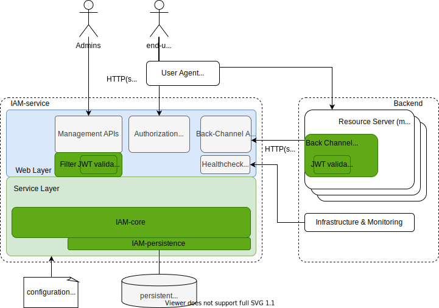

[](https://opensource.org/licenses/MIT)
[](https://travis-ci.org/jveverka/iam-service)

# IAM service
Really simple standalone *Identity Access Management* (IAM) service, authentication and authorization server. 
Project is compliant with subset of [OAuth2](https://tools.ietf.org/html/rfc6749) 
and [OpenID-connect](https://openid.net/specs/openid-connect-core-1_0.html) specifications. 
Issued tokens comply with [JWT](https://tools.ietf.org/html/rfc7519). 
Please check [use-cases and guidelines](iam-examples/README.md) for more details.

This project is __WIP__, stay tuned !

## Features
* [x] Self-Contained IAM management - users, clients, permission and roles.
* [x] Small memory footprint - __iam-service__ (32Mb JVM heap)
* [x] Small build size - __iam-service__ (single jar: ~35Mb, docker: ~182Mb)
* [x] Seamless integrations with spring framework.

## Supported OAuth2 flows
* [x] __Authorization Code__ - [flow details](docs/oauth2/131_authorization-code-flow.md).
* [x] __Password Credentials__ - [flow details](docs/oauth2/133_password-credentials-flow.md).
* [x] __Client Credentials__ - [flow details](docs/oauth2/134_client-credentials-flow.md).
* [x] __Refresh Token__ - [flow detail](docs/oauth2/15_refresh-token.md).

## Architecture


### Components
* [__iam-service__](iam-service) - [SpringBoot](https://spring.io/projects/spring-boot) IAM as microservice (standalone authorization and authentication server). 
* [__iam-core__](iam-core) - core implementation of IAM business logic (no framework dependencies).
* [__iam-persistence__](iam-persistence) - libraries for data model persistence.
* [__iam-examples__](iam-examples) - examples how to use and integrate with IAM-service.
* [__iam-common__](iam-common) - libraries for backend services.

### Build and Run
Please  check [system requirements](docs/system-requirements.md) before. 
```
gradle clean build test
docker-compose up --build -d
docker-compose down -v --rmi all --remove-orphans
```
## REST endpoints 
* [__Authorization / Authentication APIs__](docs/apis/IAM-authorization-and-authentication-apis.md) - login flows, issuing JWT, revoking JWT.
* [__Management APIs__](docs/apis/IAM-management-apis.md) - manage organization / project / users and credentials.
* [__Back-Channel APIs__](docs/apis/IAM-back-channel-apis.md) - discover organization / project / user configuration, get public keys.
* [__Health-Check API__](docs/apis/IAM-heath-check.md) - service status and health check.
* __OpenAPI / Swagger2 JSON__ - ```http://localhost:8080/v2/api-docs```
* __OpenAPI / Swagger2 UI__ - ```http://localhost:8080/swagger-ui.html```

### Technical documentation
* [Internal Data Model](docs/IAM-data-model.md) - internal data model description and glossary.
* [JWT mappings](docs/JWT-mapping-details.md) - mapping details between data model and issued JWT.

#### Related RFCs and Specifications
* [OpenID](https://openid.net/specs/openid-connect-core-1_0.html) - OpenID Connect Core 1.0
* [RFC6749](https://tools.ietf.org/html/rfc6749) - The OAuth 2.0 Authorization Framework
* [RFC7519](https://tools.ietf.org/html/rfc7519) - JSON Web Token (JWT)
* [RFC7517](https://tools.ietf.org/html/rfc7517) - JSON Web Key (JWK)
* [References](docs/references.md)
