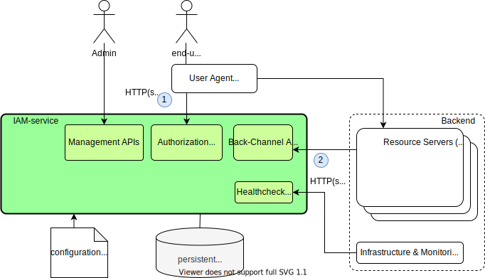

[](https://opensource.org/licenses/MIT)
[](https://img.shields.io/badge/java-11-blue)
[](https://img.shields.io/badge/gradle-v6.5-blue)

[](https://search.maven.org/search?q=one.microproject.iamservice)
[](https://sonarcloud.io/dashboard?id=jveverka_iam-service)

# IAM service - OAuth2 server
Really simple standalone *Identity Access Management* (IAM) service, [OAuth2](https://tools.ietf.org/html/rfc6749) authentication and authorization server. 
Project is compliant with subset of [OpenID-connect](https://openid.net/specs/openid-connect-core-1_0.html) 
and [OAuth2](https://tools.ietf.org/html/rfc6749) and [other](https://github.com/jveverka/iam-service#rfcs-and-specifications) related specifications. 

* Please check [__User's Guide__](docs/IAM-user-manual/README.md) and [__Examples__](iam-examples) for more details.
* Check [__Docker Hub releases__](https://hub.docker.com/r/jurajveverka/iam-service).
  ```
  docker run -d -p 8080:8080 jurajveverka/iam-service:2.5.9-RELEASE
  curl 'http://localhost:8080/services/discovery'
  curl 'http://localhost:8080/services/oauth2/iam-admins/iam-admins/.well-known/openid-configuration'
  ```
* OpenAPI documentation: ``http://localhost:8080/swagger-ui/index.html?url=/v3/api-docs#/``  
* Deploy into [__kubernetes cluster__](docs/k8s-deployments). 

## Modes of deployment


1. Unit test deployments, rapid deployments, replicas=1.
2. Simple use, single JSON file as database, replicas=1.
3. Single instance deployments, replicas>1.
4. Cluster deployments, docker or kubernetes, replicas>1.

## Features & Mission
* [x] Provide minimalistic, simple and small OAuth2/OIDC identity server. 
* [x] Self-Contained IAM management - clients, users, credentials, permission and roles.
* [x] JWTs issued for authenticated clients and user-agents.
* [x] Back Channels for JWT verification - backend libraries for resource servers. 
* [x] Small memory footprint - __iam-service__ (32Mb JVM heap)
* [x] Small build size - __iam-service__ (single jar: ~40Mb, docker: ~190Mb)
* [x] Seamless integrations with [spring framework](https://spring.io/) - check [examples](iam-examples).
* [x] In memory or [Redis](https://redis.io/) backed caches.
* [x] Data model stored in memory, single JSON file or [MongoDB](https://www.mongodb.com/).

## Supported OAuth2 flows
* [x] __Authorization Code__ - [flow details](docs/oauth2/131_authorization-code-flow.md).
* [x] __Authorization Code (With PKCE)__ - [flow details](docs/oauth2/131_authorization-code-flow.md).
* [x] __Password Credentials__ - [flow details](docs/oauth2/133_password-credentials-flow.md).
* [x] __Client Credentials__ - [flow details](docs/oauth2/134_client-credentials-flow.md).
* [x] __Refresh Token__ - [flow detail](docs/oauth2/15_refresh-tokens-flow.md).

## Architecture

1. Front channels.
2. Back channels.   
[Architecture details](docs/IAM-architecture-details.md).

### Components
* [__iam-service__](iam-service) - [SpringBoot](https://spring.io/projects/spring-boot) IAM as microservice (standalone authorization and authentication server). 
* [__iam-client__](iam-common/iam-client) - client library for back channel integrations with other microservices (resource-servers). 
* [__iam-service-client__](iam-common/iam-service-client) - client library for remote administration of iam-service (resource-servers).
* [__iam-client-spring__](iam-common/iam-client-spring) - easier integrations for springboot microservices.
* [__iam-examples__](iam-examples) - examples how to use and integrate with IAM-service.

## REST endpoints 
* [__Authorization / Authentication APIs__](docs/apis/IAM-authorization-and-authentication-apis.md) - login flows, issuing JWT, revoking JWT.
* [__Admin APIs__](docs/apis/IAM-admin-apis.md) - manage organization / project / users and credentials.
* [__Back-Channel APIs__](docs/apis/IAM-back-channel-apis.md) - discover organization / project / user configuration, get public keys.
* [__Swagger and Actuator APIs__](docs/apis/IAM-swagger-and-actuator-links.md)

### Technical documentation
* [Security Rules](docs/IAM-user-manual/IAM-Service-Security-Model.md) - accessing APIs.
* [Internal Data Model](docs/IAM-data-model.md) - internal data model description and glossary.
* [JWT mappings](docs/JWT-mapping-details.md) - mapping details between data model and issued JWT.
* [Project build & test instructions](docs/IAM-build-test.md) - how to build this project locally.

#### RFCs and Specifications
* [RFC6749](https://tools.ietf.org/html/rfc6749) - OAuth 2.0 Authorization Framework
* [RFC7009](https://tools.ietf.org/html/rfc7009) - OAuth 2.0 Token Revocation  
* [RFC7662](https://tools.ietf.org/html/rfc7662) - OAuth 2.0 Token Introspection
* [RFC6750](https://tools.ietf.org/html/rfc6750) - OAuth 2.0 Bearer Token Usage
* [RFC8414](https://tools.ietf.org/html/rfc8414) - OAuth 2.0 Authorization Server Metadata
* [RFC7636](https://tools.ietf.org/html/rfc7636) - OAuth 2.0 Proof Key for Code Exchange by OAuth Public Clients (PKCE) 
* [RFC7519](https://tools.ietf.org/html/rfc7519) - JSON Web Token (JWT)
* [RFC7517](https://tools.ietf.org/html/rfc7517) - JSON Web Key (JWK)
* [OpenID](https://openid.net/specs/openid-connect-core-1_0.html) - OpenID Connect Core 1.0
* [References](docs/references.md)
