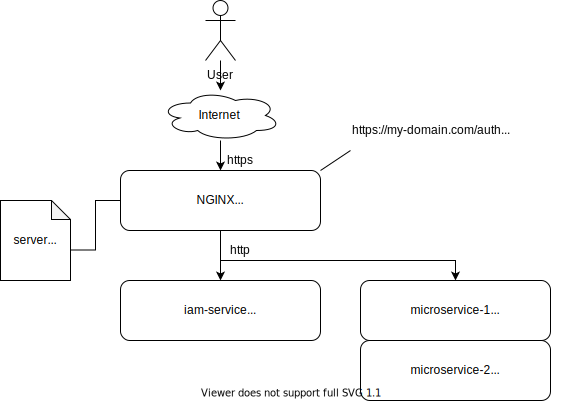

## IAM-Service behind reverse proxy
This configuration example demonstrates how to run IAM-Service 
behind [NGINX](https://www.nginx.com/) reverse proxy.



### IAM-Service setup
IAM-Service internal URL uses same prefix ``/auth`` as external public URL.
IAM-Service configuration ``application.yml`` file contains option to change 
default base URL prefix. This is recommended IAM-Service configuration:
```
server:
  port: 8080
  servlet:
    context-path: /auth
...    
```
Base URL mapping may be defined additionally if required. 
This is useful in cases when reverse proxy is used for TLS termination.
```
iam-service:
  base-url-mapping:
    base-url: http://localhost:8080
    mapped-url: https://mydomain.com
```

### Example NGINX configuration
This is recommended NGINX configuration snippet.
```
server {
    listen 443 ssl default_server;
    ssl_certificate /etc/letsencrypt/live/{my-domain.com}/fullchain.pem;
    ssl_certificate_key /etc/letsencrypt/live/{my-domain.com}/privkey.pem;
    root /opt/web;
    location / {
    }
    server_name {my-domain.com};
    location /auth/ {
          proxy_pass http://{auth-server}:8080;
    }
    location /micro-1/ {
         proxy_pass http://{service-host1}:8081;
    }
    location /micro-2/ {
                proxy_pass http://{service-host2}:8082;
    }
    if ($scheme != "https") {
        return 301 https://$host$request_uri;
    }
}
```
