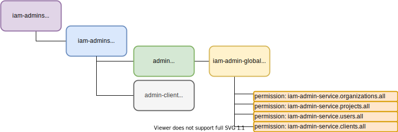

# Default IAM-Service Configuration
By default, if internal data model of *iam-service* is not populated, default data model is created.
Default data model contains one organization and one project: __iam-admins__ with single admin user 
as described below. Using this admin identity, you can create your own organization(s) and 
project(s). Each project should have own 'admin' user capable of managing just it's own project.

## 1. ADMIN - The SuperUser
This is how default data model looks like:
* __iam-admins__ organization containing admin project
* __iam-admins__ project containing admin user(s)
* __admin-client__ - client for admin user
* __admin__ - user with global admin permissions

####See also:
* How to set [secrets in default data model](01a-standalone-server-config.md).
* [Setup persistence Layer](01b_setup-persitence-layer.md) and [Caching](01c_setup-cache-layer.md).

## 2. Project Admin(s)
Each project requires it's own admin user.  

