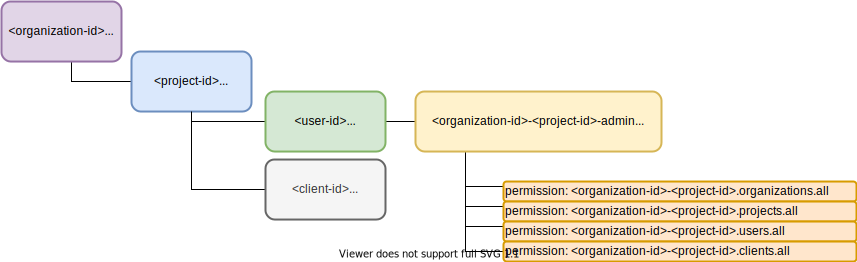

# IAM-Service Security Configuration
By default, in case internal data model of *iam-service* is not populated, default data model is created.
Default data model contains one organization and one project: __iam-admins__ with single admin user 
as described below. Using this admin identity, you can create your own organization(s) and 
project(s). Each project should have own 'admin' user capable of managing just it's own project.

## 1. ADMIN - The SuperUser
This is how default data model looks like:
* __iam-admins__ - organization containing admin project
  * __iam-admins__ - project containing admin user(s)
    * __admin-client__ - client for admin user
    * __admin__ - user with global admin permissions
* At least one admin user must exist in order to use IAM Admin functions.

## 2. Organizations / Project Admin(s)
Each organization and project requires it's own admin user. Organization and project 
structure below is created like described [here](02b-create-organization-with-admin.md) using access_token obtained from *iam-admin* as described [here](02a-get-admin-access-token.md).  

* At least one admin user must exist per organization to use Organization Admin functions.

## 3. Common Users and Clients
Each project hosts several users and clients. Those are common users and clients not suitable for organization and project admin tasks.
Such users and client are intended to be used with resource servers. 

#### See also:
* How to set [secrets in default data model](01a-standalone-server-config.md).
* [Setup persistence Layer](01b_setup-persitence-layer.md) and [Caching](01c_setup-cache-layer.md).
