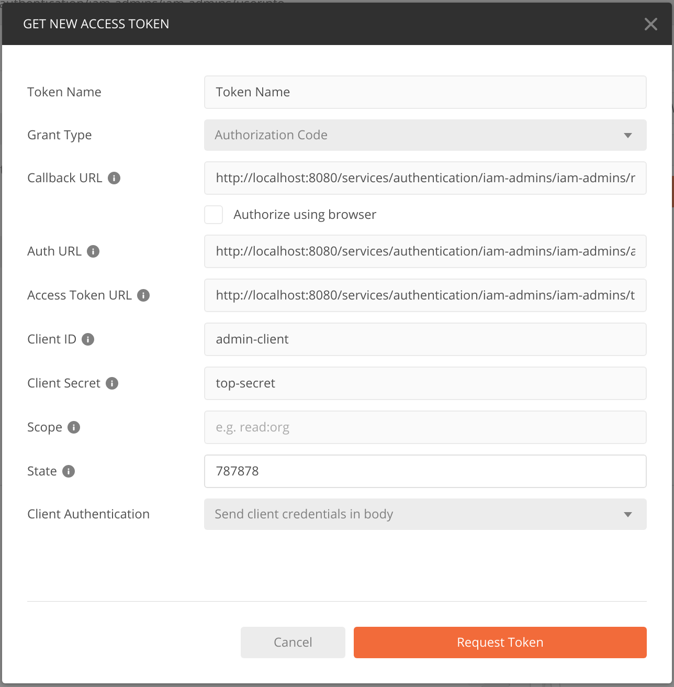
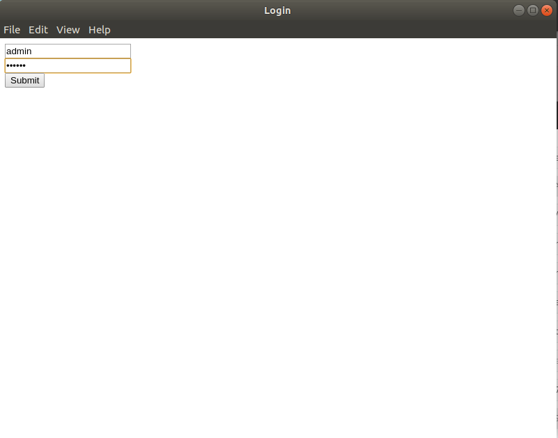
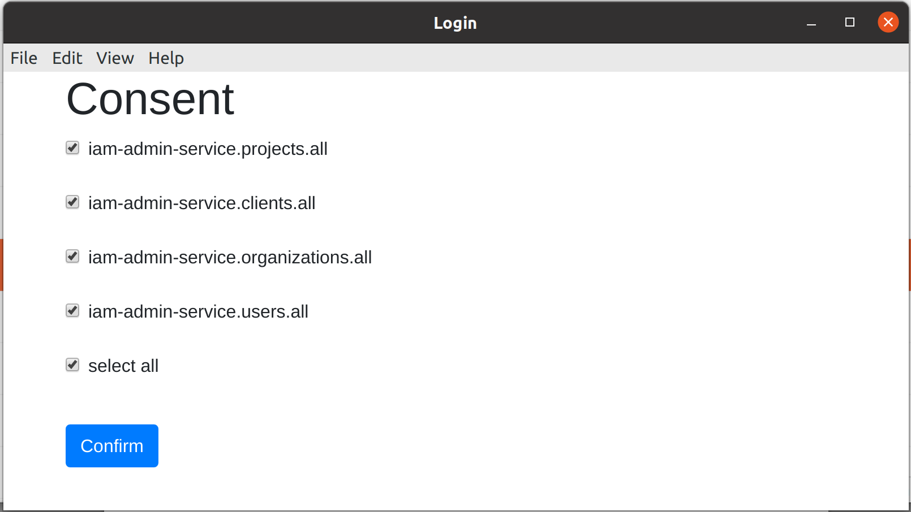
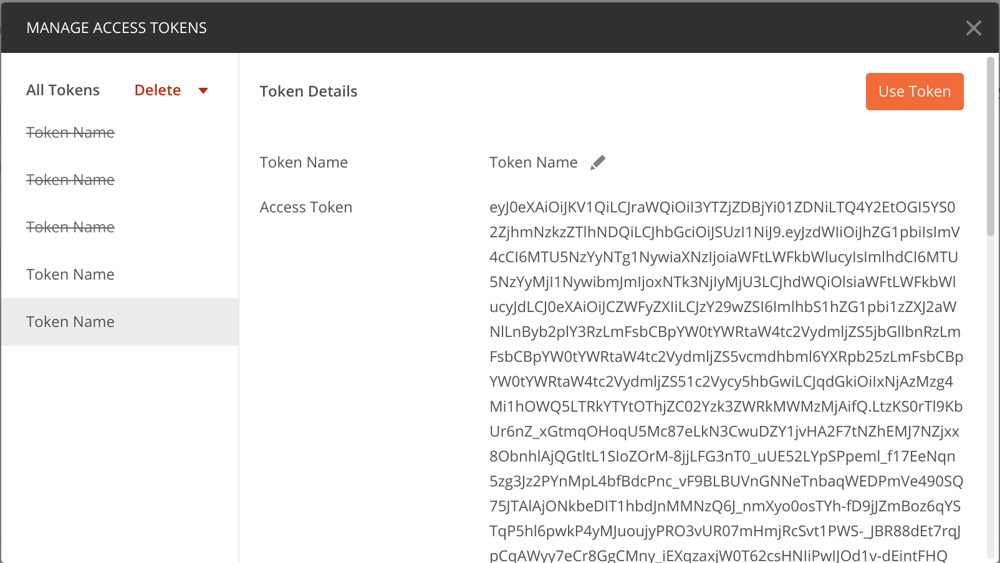
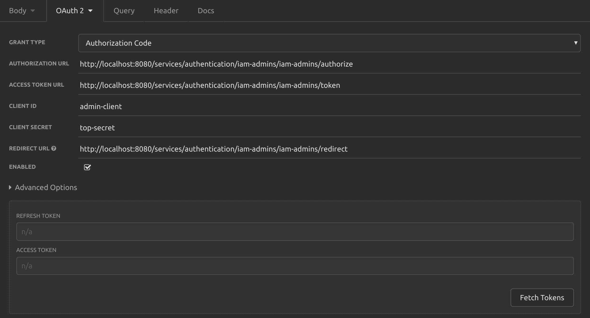
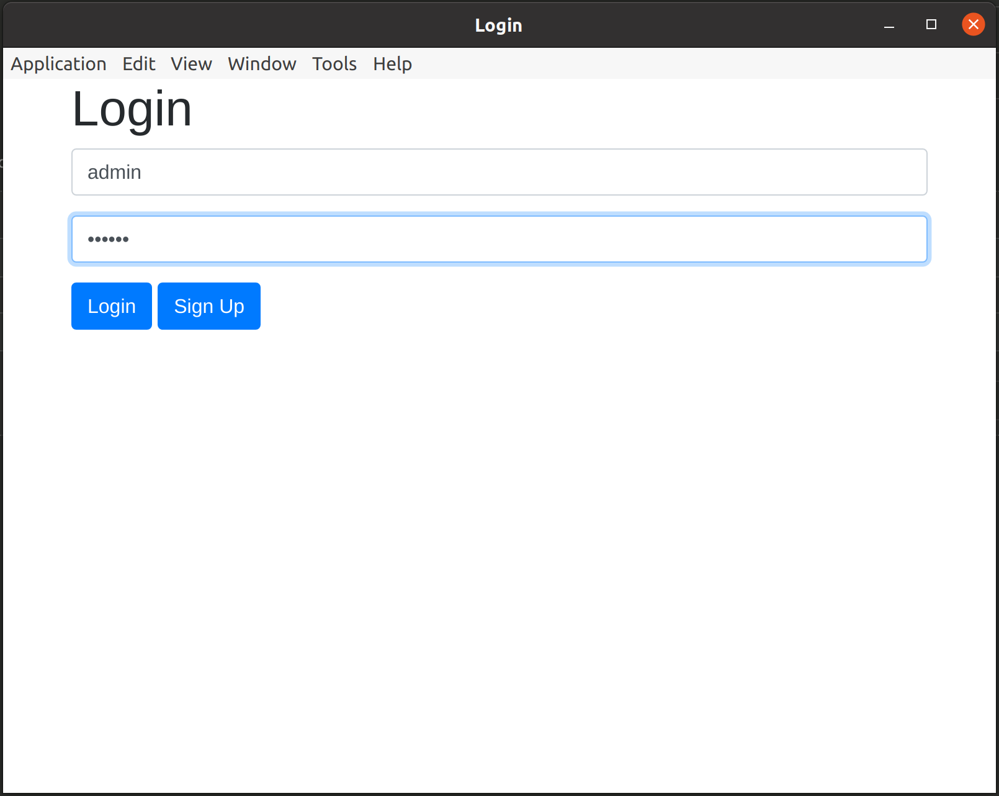
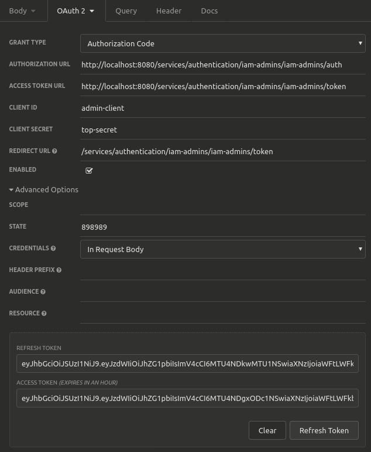
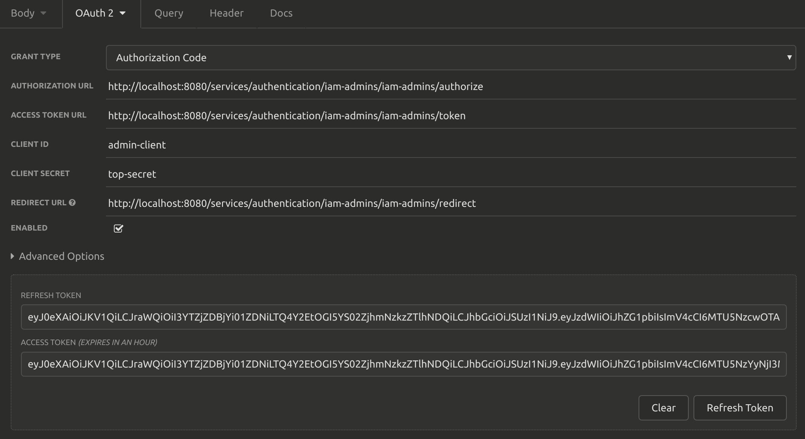

## Authorization Code Flow
[RFC reference](https://tools.ietf.org/html/rfc6749#section-1.3.1)


1. User initializes authentication and authorization flow.
2. Client sends request.
3. Request is verified by IAM-service.
4. IAM-service responds, providing login context.
5. User enters login credentials and confirms scope (consent)
6. Client sends login context and user's credentials ti IAM-service.
7. IAM-service has now complete authentication and authorization request, claims and after verification, issues authorization code.
8. Client received authorization code and the list of available scopes / permissions - consent screen.
9. User sends back list of approved scopes and gets redirected to redirect_uri.
10. 
11. 
12. 
13.     
14.
15. Access resources using tokens.

### Test in Browser
* Init login flow using web browser.
  ```
  http://localhost:8080/services/authentication/iam-admins/iam-admins/authorize?response_type=code&state=123444&client_id=admin-client&scope=&redirect_uri=http%3A%2F%2Flocalhost%3A8080%2Fservices%2Fauthentication%2Fiam-admins%2Fiam-admins%2Fredirect
  ``` 

### Test in Postman

* __Grant Type__ : Authorization Code
* __Callback URL__: ```http://localhost:8080/services/authentication/iam-admins/iam-admins/redirect```
* __Auth URL__: ```http://localhost:8080/services/authentication/iam-admins/iam-admins/authorize```
* __Access Token URL__ : ```http://localhost:8080/services/authentication/iam-admins/iam-admins/token```
* __Client ID__: admin-client
* __Client Secret__: top-secret
* __Scope__: ""
* __State__: <random-string>

 
 
 


### Test in Insomnia
 
 
 
