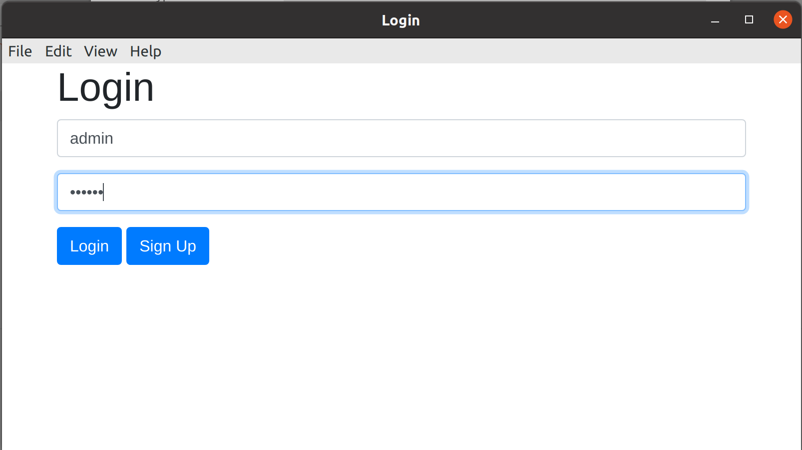
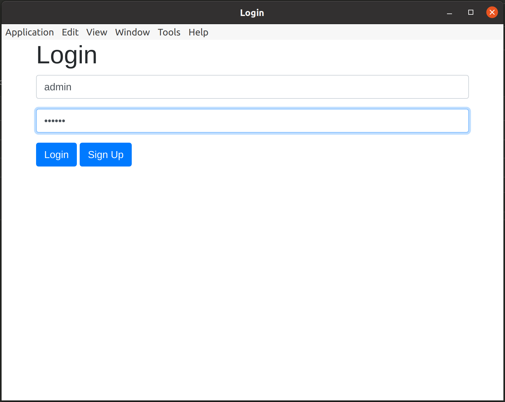
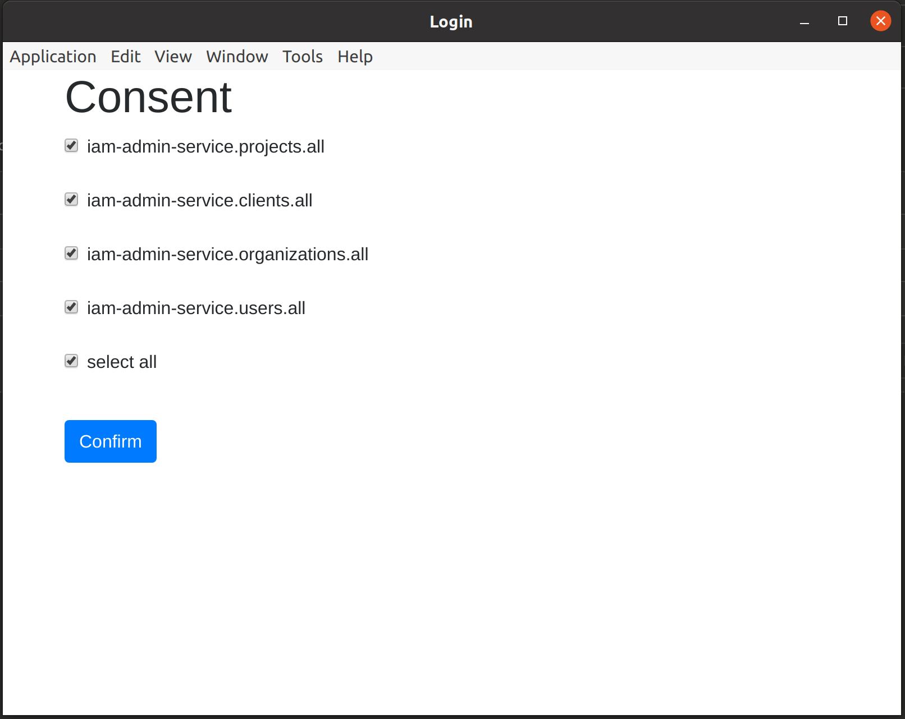

## Client Credentials Flow
[RFC reference](https://tools.ietf.org/html/rfc6749#section-1.3.1)
* __Grant Type__ : Authorization Code
* __Callback URL__: ```/services/authentication/iam-admins/iam-admins/token```
* __Auth URL__: ```http://localhost:8080/services/authentication/iam-admins/iam-admins/auth```
* __Access Token URL__ : ```http://localhost:8080/services/authentication/iam-admins/iam-admins/token```
* __Client ID__: admin-client
* __Scope__: ""
* __State__: <random-string>

### Test in Postman
 
 
 

### Test in Insomnia
 
 
 