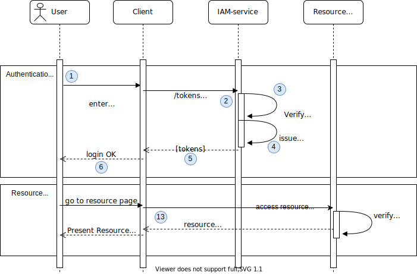

## Password Credentials Flow
[RFC reference](https://tools.ietf.org/html/rfc6749#section-1.3.3)



* Get tokens using Password Credentials Flow.
  ```
  curl --location --request POST 'http://localhost:8080/services/oauth2/{organization-id}/{project-id}/token?grant_type=password&username={username}&password={password}&scope={scopes}&client_id={id}&client_secret={secret}' \
  --header 'Content-Type: application/x-www-form-urlencoded'   
  ```
1. User enters client and user credentials.
2. Client application sends __POST__ request above with client and user credentials.
3. iam-service verifies organization / project, client and user credentials.
4. iam-service issues tokens if verification above is successful.
5. tokens are provided to client application.
6. login procedure is complete.
7. [Token Verification process, back channel](token-verification-back-channel.md).
8. client application use access_token to access resources.
9. [Refresh Tokens flow](15_refresh-tokens-flow.md).

### Test in Postman or Insomnia
| Name                 | Value                                                                    |
|----------------------|--------------------------------------------------------------------------|
| __Grant Type__       | Password Credentials                                                     | 
| __Access Token URL__ | ```http://localhost:8080/services/oauth2/iam-admins/iam-admins/token```  |
| __Username__         | admin                                                                    | 
| __Password__         | secret                                                                   | 
| __Client ID__        | admin-client                                                             | 
| __Client Secret__    | top-secret                                                               | 
| __Scope__            | ""                                                                       |  
