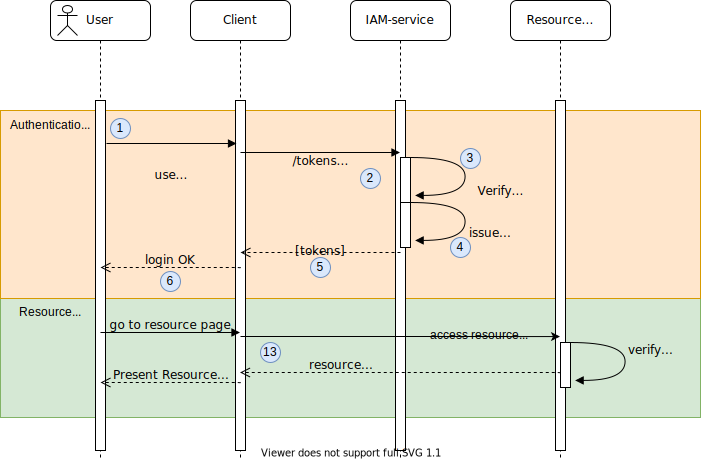

## Client Credentials Flow
[RFC reference](https://tools.ietf.org/html/rfc6749#section-1.3.4)

* __POST__ ``http://localhost:8080/services/authentication/{organization-id}/{project-id}/token``
  ``grant_type=client_credentials&scope=<scopes>&client_id=<id>&client_secret=<secret>``

### Test in Postman

### Test in Insomnia

