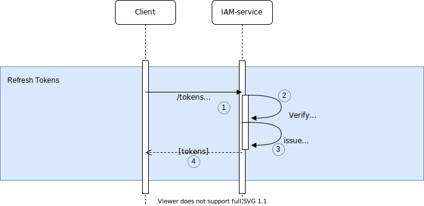
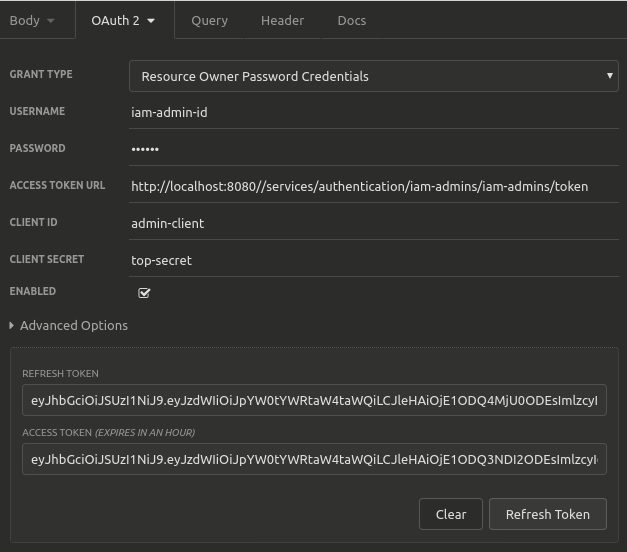

## Refresh Token
[RFC reference](https://tools.ietf.org/html/rfc6749#section-1.5)



* Renew access_token and refresh_token using refresh token flow. 
  ```
  curl --location --request POST 'http://localhost:8080/services/oauth2/{organization-id}/{project-id}/token?grant_type=refresh_token&refresh_token={refresh_token}&scope={scope}&client_id={client_id}&client_secret={client_secret}' \
  --header 'Content-Type: application/x-www-form-urlencoded'
  ```
1. Client application sends __POST__ request above with client credentials.
2. iam-service verifies organization / project, client credentials.
3. iam-service issues tokens if verification above is successful.
4. tokens are provided to client application.

### Test in Insomnia
 
