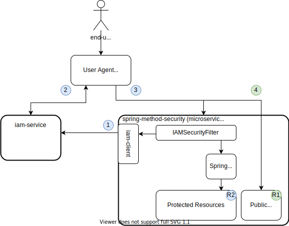

# Spring Method Security Demo
This __iam-service__ integration demo utilizes [Spring Security Framework](https://docs.spring.io/spring-security/site/docs/5.3.3.BUILD-SNAPSHOT/reference/html5/#preface), 
particularly [method security](https://www.baeldung.com/spring-security-method-security). 
JWT tokens issued by __iam-service__ are used to get access to resources hosted by __spring-method-security__ service. 



1. __spring-method-security__ downloads the list of JWKs over http back channel as specified in RFC7517 on startup and caches updated JWK list.
2. __iam-service__ issues token to client application using one of supported OAuth2 flows.
3. __client application__ uses issued JWT token to access *Protected Resources*. 
4. __client application__ can access *Public Resources* directly without any authorization.

* [__R1__ DataController](src/main/java/one/microproject/iamservice/examples/methodsecurity/controller/DataController.java)
    Protected resource by 
    ```
    @EnableGlobalMethodSecurity(securedEnabled = true, prePostEnabled = true)
    ```
  * __GET__ ``/services/secure/data`` - Protected by:
    ```
    @PreAuthorize("hasAuthority('spring-method-security.secure-data.read')")
    ```
  * __POST__ ``/services/secure/data`` - Protected by:
    ```
    @PreAuthorize("hasAuthority('spring-method-security.secure-data.read') and 
    hasAuthority('spring-method-security.secure-data.write')")
    ``` 
* [__R2__ SystemController](src/main/java/one/microproject/iamservice/examples/methodsecurity/controller/SystemController.java)
  Unprotected resources
  * __GET__ ``/services/public/info``
  * __GET__ ``/services/public/update-iam-client-cache`` 
  * __OpenAPI / Swagger JSON__ - ```http://localhost:8082/v3/api-docs```
  * __OpenAPI / Swagger YAML__ - ```http://localhost:8082/v3/api-docs.yaml```
  * __OpenAPI / Swagger UI__ - ```http://localhost:8082/swagger-ui/index.html?url=/v3/api-docs```


## Build and Run
```
gradle clean build
java -jar build/libs/spring-method-security-2.5.2-RELEASE.jar
```

### Build Docker image 
```
docker build . -t spring-method-security:2.5.2-RELEASE
docker image list
docker save --output="build/spring-method-security:2.5.2-RELEASE.tar" spring-method-security:2.5.2-RELEASE
docker image rm -f <imageid>
docker run -p 8082:8082 spring-method-security:2.5.2-RELEASE
```
