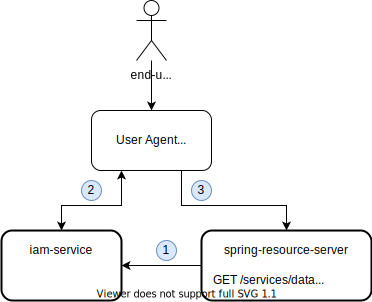

# Spring Resource Server Demo 
This __iam-service__ integration demo utilizes [Spring Security Framework](https://docs.spring.io/spring-security/site/docs/5.3.3.BUILD-SNAPSHOT/reference/html5/#preface), 
particularly [OAuth2 resource server](https://docs.spring.io/spring-security/site/docs/5.3.3.BUILD-SNAPSHOT/reference/html5/#oauth2resourceserver). 
JWT tokens issues by __iam-service__ are used to get access to resources hosted by __spring-resource-server__. 



1. spring-resource-server downloads the list of JWKs over http as specified in RFC7517 on startup.
2. __iam-service__ issues token to client application using one of supported OAuth2 flows.
3. __client application__ uses issued JWT token to access resources hosted on __spring-resource-server__. 

# Build and Run
```
gradle clean build
java -jar build/libs/spring-resource-server-0.0.1-SNAPSHOT.jar
```

### Reference Documentation
* [OAuth 2.0 Resource Server](https://docs.spring.io/spring-security/site/docs/5.3.3.BUILD-SNAPSHOT/reference/html5/#oauth2resourceserver)
* [SpringBoot OAuth2 Resource Server](https://docs.spring.io/spring-boot/docs/2.3.0.RELEASE/reference/htmlsingle/#boot-features-security-oauth2-server)

